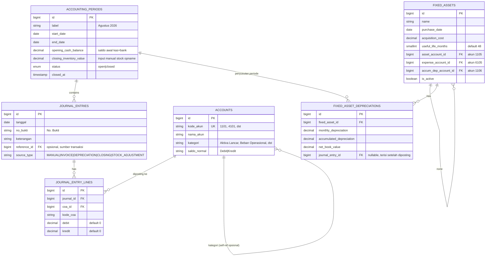

# Dokumentasi Teknis: Sistem Financial Report (Excel → Laravel + Filament)

**Sumber analisis:** `LAPORAN_KEUANGAN_AGUSTUS.xlsx` — PT Bigatri Indoflora Pacific (Bloomorist)
**Tujuan dokumen:** Menjadi spesifikasi dan catatan implementasi sistem akuntansi Laravel + Filament yang mempertahankan struktur, nama sheet, dan logika workbook Excel, sekaligus mendokumentasikan penyempurnaan yang sudah diterapkan.

> **Status implementasi (16 September 2026):** Milestone utama 1–7 sudah diimplementasikan dan divalidasi. Alur invoice berbayar → mutasi stok → Jurnal Umum → Neraca Saldo → Laba Rugi/Neraca/Arus Kas → health check → Tutup Periode sudah berhasil diuji lintas periode. Seluruh data simulasi September dan Oktober 2026 telah dihapus; periode historis yang tersisa adalah Agustus 2026.

### Istilah resmi dan nama menu

Nama berikut mengikuti sheet Excel dan dipakai sebagai istilah pengguna di aplikasi:

| Sheet Excel | Menu/fitur Filament |
|---|---|
| Dashboard | Dashboard |
| Penyusutan Peralatan | Penyusutan Peralatan |
| Daftar Akun | Daftar Akun |
| Jurnal Umum | Jurnal Umum |
| Buku Besar | Buku Besar |
| Neraca Saldo | Neraca Saldo |
| Laba Rugi | Tab Laba Rugi pada Financial Report |
| Neraca | Tab Neraca pada Financial Report |
| Arus Kas | Tab Arus Kas pada Financial Report |
| Data Bulanan | Monthly Summary/tren pada Dashboard |

Seluruh menu akuntansi berada langsung dalam satu grup navigasi **Accounting & Finances**. **Financial Report** adalah halaman terpadu dengan tiga tab: **Laba Rugi**, **Neraca**, dan **Arus Kas**. Menu Arus Kas standalone dan Report Templates tidak ditampilkan di navigasi karena fungsinya sudah tercakup atau bersifat konfigurasi internal.

---

## 1. Ringkasan Sistem Sumber

Workbook terdiri dari 10 sheet yang saling terhubung lewat rumus. Implementasi aplikasi mempertahankan model **double-entry** dengan metode persediaan periodik (*physical/periodic inventory*). Urutan ketergantungan datanya seperti ini:

```mermaid
flowchart TD
    COA[Daftar Akun\n(Chart of Accounts)] --> JU[Jurnal Umum\n(General Journal)]
    JU --> BB[Buku Besar\n(General Ledger - per akun)]
    JU --> NS[Neraca Saldo\n(Trial Balance - SUMIFS per akun)]
    NS --> LR[Laba Rugi\n(Income Statement)]
    NS --> NR[Neraca\n(Balance Sheet)]
    LR --> NR
    JU --> AK[Arus Kas\n(Direct Method Cash Flow)]
    NS --> AK
    PP[Penyusutan Peralatan\n(Depreciation Schedule)] --> JU
    LR --> DB[Dashboard]
    NS --> DB
    NR --> DB
    LR --> DBL[Data Bulanan\n(Rekap Trend Bulanan)]
    AK --> DBL
```

**Poin penting arsitektur sumber:**
1. **Jurnal Umum adalah satu-satunya sumber transaksi.** Semua laporan lain (Buku Besar, Neraca Saldo, Laba Rugi, Neraca, Arus Kas) adalah hasil turunan (derived/computed), bukan input manual.
2. **Neraca Saldo dihitung ulang penuh dari Jurnal Umum** tiap kali dibuka (`SUMIFS` per kode akun), tidak disimpan sebagai snapshot.
3. **Penyusutan Peralatan adalah modul perhitungan dan posting jurnal.** `DepreciationService` menghitung penyusutan garis lurus, melindungi dari posting ganda, dan mendukung *catch-up depreciation*; hasil posting masuk ke Jurnal Umum sebagai debit *Beban Penyusutan* dan kredit *Akumulasi Penyusutan* — lihat detail di §10.
4. **Persediaan akhir (stock opname) adalah input manual per periode**, bukan hasil hitung otomatis dari jurnal — ini adalah karakteristik metode persediaan periodik.
5. Ada 3 formula validasi bawaan (balance check) yang harus direplikasi sebagai *system health check*: keseimbangan Neraca Saldo, keseimbangan Neraca, dan kecocokan saldo kas Arus Kas vs Neraca Saldo.

Di Laravel/Filament, prinsip yang sama dipertahankan: **jangan simpan angka laporan sebagai sumber kebenaran**. Transaksi disimpan di Jurnal Umum, lalu laporan dihitung melalui service. `monthly_summaries` hanya merupakan read-model untuk periode yang sudah ditutup dan tidak menggantikan jurnal.

---

## 2. Skema Database (ERD)



**Catatan desain penting (perbaikan dari kelemahan versi Excel):**

- **`journal_id`** menggantikan trik pencocokan "akun lawan" via `INDEX/MATCH` berdasarkan tanggal+keterangan yang sama. Relasi item jurnal menjadi sumber hubungan transaksi yang eksplisit.
- Kategori akun memakai kategori Excel secara langsung: `Aktiva Lancar`, `Aktiva Tetap`, `Aktiva Tetap (Kontra)`, `Kewajiban Lancar`, `Modal`, `Modal (Kontra)`, `Pendapatan`, `Pendapatan (Kontra)`, `Pendapatan Lain-Lain`, `Beban Pokok Penjualan`, `Beban Pokok Penjualan (Kontra)`, dan `Beban Operasional`.
- Saldo kontra tidak disimpan sebagai flag terpisah; arah saldo ditentukan oleh `saldo_normal` dan kategori kontra saat laporan Neraca/Laba Rugi dihitung.
- Rentang baris hardcode Excel (`$F$6:$F$909` vs `$F$6:$F$2564`) **tidak relevan lagi**. Aplikasi memfilter Jurnal Umum berdasarkan tanggal `AccountingPeriod`, sehingga semua baris periode ikut dihitung tanpa batas baris Excel.

---

## 3. Modul 1 — Master Data: Chart of Accounts (Daftar Akun)

Seeder awal berdasarkan COA yang ada di file sumber:

| Kode | Nama Akun | Kategori | Saldo Normal | Kontra? |
|---|---|---|---|---|
| 1101 | Kas | Aktiva Lancar | Debit | |
| 1102 | Bank | Aktiva Lancar | Debit | |
| 1103 | Piutang Dagang | Aktiva Lancar | Debit | |
| 1104 | Persediaan Bunga | Aktiva Lancar | Debit | |
| 1105 | Peralatan | Aktiva Tetap | Debit | |
| 1106 | Akumulasi Penyusutan Peralatan | Aktiva Tetap | Kredit | ✅ |
| 1107 | Piutang Ongkir | Aktiva Lancar | Debit | |
| 1108 | Perlengkapan | Aktiva Lancar | Debit | |
| 1109 | Piutang Investasi | Aktiva Lancar | Debit | |
| 1110 | Uang Muka Pembelian Petani | Aktiva Lancar | Debit | |
| 1111 | Gaji Bayar di Muka | Aktiva Lancar | Debit | |
| 1112 | Uang Muka Pembelian Tanah | Aktiva Tetap | Debit | |
| 2101 | Hutang Dagang | Kewajiban Lancar | Kredit | |
| 2102 | Uang Muka Penjualan | Kewajiban Lancar | Kredit | |
| 3101 | Modal Pemilik | Modal | Kredit | |
| 3102 | Prive | Modal | Debit | ✅ |
| 4101 | Penjualan | Pendapatan | Kredit | |
| 4102 | Retur Penjualan | Pendapatan | Debit | ✅ |
| 4103 | Pendapatan Bunga | Pendapatan Lain-Lain | Kredit | |
| 4104 | Pendapatan Lain-Lain | Pendapatan Lain-Lain | Kredit | |
| 5101 | Pembelian Bunga | Beban Pokok Penjualan | Debit | |
| 5102 | Retur Pembelian | Beban Pokok Penjualan | Kredit | ✅ |
| 5103 | Beban Angkut Pembelian | Beban Pokok Penjualan | Debit | |
| 5104 | HPP | Beban Pokok Penjualan | Debit | *(tidak dipakai — lihat §12)* |
| 6101 | Beban Gaji | Beban Operasional | Debit | |
| 6102 | Beban Sewa | Beban Operasional | Debit | |
| 6103 | Beban Utilitas | Beban Operasional | Debit | |
| 6104 | Beban Angkut Penjualan | Beban Operasional | Debit | |
| 6105 | Beban Penyusutan | Beban Operasional | Debit | |
| 6106 | Beban Kerugian Bunga Rusak/Layu | Beban Operasional | Debit | |
| 6107 | Beban Perlengkapan | Beban Operasional | Debit | |
| 6108 | Beban Lain-Lain | Beban Operasional | Debit | |
| 6109 | Beban Akomodasi | Beban Operasional | Debit | |
| 6110 | Beban Pesangon | Beban Operasional | Debit | |

**Filament Resource:** `ChartOfAccountResource` — ditampilkan sebagai menu **Daftar Akun**, dengan `kode_akun` unik, `kategori` mengikuti kategori Excel, dan `saldo_normal` Debit/Kredit.

---

## 4. Modul 2 — Transaksi: Jurnal Umum (General Journal)

### 4.1 Struktur asli vs struktur baru
Di Excel, satu transaksi = 2 baris terpisah (baris debit & baris kredit) yang dihubungkan lewat kesamaan tanggal + keterangan. Di aplikasi, satu transaksi = **1 record `bl_general_journals_t`** (`GeneralJournal`) dengan **N baris `bl_journal_items_t`** (`JournalItem`) (minimal 2 baris, mendukung jurnal majemuk).

### 4.2 Aturan validasi wajib (menggantikan kolom bantu Excel: `Urutan/Akun`, `Kunci Pencarian`, `Kode Akun Lawan`)
Semua kolom bantu I, J, K, L di sheet Jurnal Umum sumber (`COUNTIF`, `INDEX/MATCH` berbasis tanggal+keterangan) **tidak perlu direplikasi**, karena relasi `journal_entry_id` sudah menyelesaikan masalah yang coba dipecahkan kolom-kolom itu. Yang perlu dijaga hanyalah:

- **Rule 1 — Balance check:** `SUM(lines.debit) === SUM(lines.credit)` untuk satu `journal_entry_id`. Wajib ditolak jika tidak sama (`0` toleransi, gunakan integer/cent-based decimal untuk hindari floating point error).
- **Rule 2 — Setiap baris hanya boleh diisi salah satu:** `debit > 0 XOR credit > 0` (tidak boleh dua-duanya nol, tidak boleh dua-duanya terisi).
- **Rule 3 — Minimal 2 baris per entry.**
- **Rule 4 — Tanggal entry harus berada dalam rentang `AccountingPeriod` yang sedang aktif** dan periode tersebut berstatus `open`. Periode ditentukan dari tanggal jurnal, bukan foreign key periode pada setiap jurnal.

### 4.3 Implementasi aplikasi

Jurnal manual memakai `GeneralJournalResource` dan validasi double-entry. Jurnal otomatis juga memakai tabel yang sama dengan `source_type` yang membedakan asal transaksi, antara lain `INVOICE`, `DEPRECIATION`, `CLOSING`, dan `STOCK_ADJUSTMENT`. Invoice berstatus `pending` yang berubah menjadi `paid` diproses oleh `InvoiceStatusService` dalam satu transaksi database: total invoice dihitung ulang, stok dikurangi, jurnal penjualan dibuat, lalu status diubah menjadi `paid`.

Contoh service generik berikut tetap menjadi aturan desain:

```php
class JournalEntryService
{
    public function create(array $header, array $lines): JournalEntry
    {
        $totalDebit  = collect($lines)->sum('debit');
        $totalCredit = collect($lines)->sum('credit');

        if (bccomp($totalDebit, $totalCredit, 2) !== 0) {
            throw new UnbalancedJournalException($totalDebit, $totalCredit);
        }

        return DB::transaction(function () use ($header, $lines) {
            $entry = JournalEntry::create($header);
            foreach ($lines as $i => $line) {
                $entry->lines()->create([
                    'account_id' => $line['account_id'],
                    'debit'      => $line['debit'] ?? 0,
                    'credit'     => $line['credit'] ?? 0,
                    'line_no'    => $i + 1,
                ]);
            }
            return $entry;
        });
    }
}
```

**Filament Resource:** `GeneralJournalResource` dengan `Repeater` untuk baris jurnal. Menu tampil sebagai **Jurnal Umum**.

---

## 5. Modul 3 — Buku Besar (General Ledger)

### 5.1 Logika sumber
Sheet Excel memakai kombinasi `INDEX/MATCH` + kolom bantu untuk mencari baris ke-N dari akun tertentu, lalu menghitung saldo berjalan (`running balance`) dengan `SUM($D$9:D9)-SUM($E$9:E9)` (kumulatif dari baris pertama sampai baris sekarang).

### 5.2 Terjemahan ke Eloquent
Tidak perlu index buatan — cukup query terurut lalu hitung running balance di PHP (atau pakai *window function* SQL `SUM() OVER()` jika ingin dilakukan di database):

```php
public function getLedger(int $accountId, int $periodId): Collection
{
    $account = Account::findOrFail($accountId);

    $lines = JournalEntryLine::with('journalEntry')
        ->where('account_id', $accountId)
        ->whereHas('journalEntry', fn ($q) => $q->where('accounting_period_id', $periodId))
        ->join('journal_entries', 'journal_entries.id', '=', 'journal_entry_lines.journal_entry_id')
        ->orderBy('journal_entries.entry_date')
        ->orderBy('journal_entries.id')
        ->select('journal_entry_lines.*', 'journal_entries.entry_date', 'journal_entries.description', 'journal_entries.reference_no')
        ->get();

    $running = 0;
    return $lines->map(function ($line) use (&$running, $account) {
        $running += $account->normal_balance === 'debit'
            ? ($line->debit - $line->credit)
            : ($line->credit - $line->debit);

        $line->running_balance = $running;
        return $line;
    });
}
```

> Setara SQL window function (lebih efisien untuk data besar):
> ```sql
> SELECT jel.*, je.entry_date, je.description,
>   SUM(CASE WHEN a.normal_balance = 'debit' THEN jel.debit - jel.credit
>            ELSE jel.credit - jel.debit END)
>     OVER (ORDER BY je.entry_date, je.id) AS running_balance
> FROM journal_entry_lines jel
> JOIN journal_entries je ON je.id = jel.journal_entry_id
> JOIN accounts a ON a.id = jel.account_id
> WHERE jel.account_id = ? AND je.accounting_period_id = ?
> ORDER BY je.entry_date, je.id;
> ```

**Filament:** `BukuBesar` adalah halaman custom dengan filter **Accounting Period**, bukan input tanggal mulai dan tanggal selesai manual. Saldo akhir ditampilkan di footer.

---

## 6. Modul 4 — Neraca Saldo (Trial Balance)

### 6.1 Rumus asli (per akun, sel `C6` & `D6`)
```
Debit  = MAX(0, SUMIFS(Jurnal.Debit, Jurnal.KodeAkun, KodeIni) - SUMIFS(Jurnal.Kredit, Jurnal.KodeAkun, KodeIni))
Kredit = MAX(0, SUMIFS(Jurnal.Kredit, Jurnal.KodeAkun, KodeIni) - SUMIFS(Jurnal.Debit, Jurnal.KodeAkun, KodeIni))
```
Pola ini **generik untuk semua akun** — tidak tergantung kategori/saldo normal akun tersebut. Hasilnya: akun akan muncul di kolom Debit jika net-nya positif ke debit, dan sebaliknya. Baris total (`SUM` semua debit vs `SUM` semua kredit) harus sama — inilah *balance check* trial balance.

### 6.2 Terjemahan Eloquent (per akun)

```php
public function trialBalanceRow(Account $account, int $periodId): array
{
    $sumDebit  = JournalEntryLine::whereAccountAndPeriod($account->id, $periodId)->sum('debit');
    $sumCredit = JournalEntryLine::whereAccountAndPeriod($account->id, $periodId)->sum('credit');

    return [
        'account' => $account,
        'debit'   => max(0, $sumDebit - $sumCredit),
        'credit'  => max(0, $sumCredit - $sumDebit),
    ];
}
```

Untuk seluruh COA sekaligus (lebih efisien, satu query agregasi bukan N+1):

```php
$rows = JournalEntryLine::query()
    ->join('journal_entries', 'journal_entries.id', '=', 'journal_entry_lines.journal_entry_id')
    ->where('journal_entries.accounting_period_id', $periodId)
    ->groupBy('account_id')
    ->selectRaw('account_id, SUM(debit) as total_debit, SUM(credit) as total_credit')
    ->get()
    ->keyBy('account_id');

foreach (Account::all() as $account) {
    $r = $rows->get($account->id);
    $debit  = $r ? max(0, $r->total_debit - $r->total_credit) : 0;
    $credit = $r ? max(0, $r->total_credit - $r->total_debit) : 0;
    // ... simpan ke hasil
}
```

### 6.3 Input manual: Persediaan Akhir (Stock Opname)
Di file sumber, baris terakhir Neraca Saldo (`1104 - Persediaan Bunga (Akhir) - Memo, hasil stock opname`) **bukan hasil SUMIFS**, melainkan angka yang diketik manual tiap periode (hasil hitung fisik gudang). Ini **wajib** menjadi field input manual di level `accounting_periods.closing_inventory_value`, **bukan** dihitung dari jurnal. Field ini dipakai khusus untuk perhitungan HPP di §7.2 — nilai akun `1104` yang berasal dari saldo jurnal (SUMIFS biasa) tetap dipakai sebagai **Persediaan Awal**.

**Filament:** field `closing_inventory_value` diisi melalui form `AccountingPeriod`. Proses **Tutup Periode** menolak periode jika nilai stock opname belum diisi.

**Validasi bawaan (replikasi cek Excel `B40`):**
```php
if (bccomp($totalAllDebit, $totalAllCredit, 2) !== 0) {
    // flag: "TIDAK SEIMBANG - cek jurnal!"
}
```

---

## 7. Modul 5 — Laporan Laba Rugi (Income Statement)

### 7.1 Pemetaan akun → baris laporan
Tabel ini adalah terjemahan langsung dari rumus sheet `Laba Rugi` (kolom C, mengacu ke `Neraca Saldo` kolom C+D per kode akun):

| Baris Laporan | Akun (kode) | Formula |
|---|---|---|
| Penjualan | 4101 | saldo akun |
| Retur Penjualan | 4102 | **–** saldo akun (kontra) |
| **Penjualan Bersih** | | Penjualan + Retur Penjualan |
| Pembelian Bunga | 5101 | saldo akun |
| Retur Pembelian | 5102 | **–** saldo akun (kontra) |
| **Pembelian Bersih** | | Pembelian Bunga + Retur Pembelian |
| Beban Angkut Pembelian | 5103 | saldo akun |
| Persediaan Awal | 1104 (saldo jurnal, bukan memo) | saldo akun |
| **Barang Tersedia Dijual** | | Persediaan Awal + Pembelian Bersih + Beban Angkut Pembelian |
| Persediaan Akhir | *manual (stock opname)* | **–** nilai input manual |
| **HPP** | | Barang Tersedia Dijual + Persediaan Akhir(negatif) |
| **LABA KOTOR** | | Penjualan Bersih – HPP |
| Beban Gaji…Beban Pesangon | 6101–6110 (kecuali yg dipakai di HPP) | saldo masing-masing akun |
| **Total Beban Operasional** | | SUM semua beban operasional |
| **LABA USAHA** | | Laba Kotor – Total Beban Operasional |
| Pendapatan Bunga | 4103 | saldo akun |
| Pendapatan Lain-Lain | 4104 | saldo akun |
| **Total Pendapatan di Luar Usaha** | | jumlah keduanya |
| **LABA BERSIH** | | Laba Usaha + Total Pendapatan di Luar Usaha |

### 7.2 Desain yang direkomendasikan: Report Line Template (bukan hardcode)

Alih-alih menulis kondisi manual per akun di kode (rawan bug tiap kali ada akun baru — persis seperti kelemahan hardcode row range di Excel), buat tabel konfigurasi:

```php
Schema::create('report_line_templates', function (Blueprint $table) {
    $table->id();
    $table->string('report_type');      // 'income_statement' | 'balance_sheet' | 'cash_flow'
    $table->string('line_key');         // 'net_sales', 'cogs', dst
    $table->string('label');
    $table->string('parent_line_key')->nullable(); // untuk subtotal
    $table->json('account_codes');      // ["4101"] atau ["6101","6102",...] atau pattern ["6*"]
    $table->smallInteger('sign');       // 1 atau -1 (akun kontra = -1)
    $table->smallInteger('sort_order');
    $table->boolean('is_subtotal')->default(false);
    $table->string('subtotal_formula')->nullable(); // "sales + sales_returns" dievaluasi via expression parser sederhana, atau relasi antar line_key
});
```

Dengan pendekatan ini, aturan laporan dapat dikonfigurasi; implementasi laporan saat ini tetap berada di `AccountingService`:
```php
public function generate(int $periodId): array
{
    $trialBalance = $this->trialBalanceService->getAll($periodId); // keyBy account_code
    $templates = ReportLineTemplate::where('report_type', 'income_statement')->orderBy('sort_order')->get();

    $results = [];
    foreach ($templates as $tpl) {
        if ($tpl->is_subtotal) {
            $results[$tpl->line_key] = $this->evaluateSubtotal($tpl, $results);
            continue;
        }
        $amount = 0;
        foreach ($this->resolveAccountCodes($tpl->account_codes, $trialBalance) as $code) {
            $bal = $trialBalance[$code]->debit + $trialBalance[$code]->credit; // salah satu selalu 0
            $amount += $bal * $tpl->sign;
        }
        $results[$tpl->line_key] = $amount;
    }
    return $results;
}
```

Ini membuat penambahan akun baru di masa depan **tidak perlu deploy kode baru** — cukup tambah baris di `report_line_templates` lewat Filament (buat `ReportLineTemplateResource` khusus admin/akuntan senior).

> Implementasi saat ini menggunakan `AccountingService` sebagai service laporan utama. `ReportLineTemplateResource` tersedia sebagai konfigurasi internal dan tidak ditampilkan sebagai menu operasional.

---

## 8. Modul 6 — Neraca (Balance Sheet)

### 8.1 Pemetaan akun → baris laporan

**AKTIVA LANCAR:** Kas (1101) + Bank (1102) + Piutang Dagang (1103) + Piutang Ongkir (1107) + Uang Muka Pembelian Petani (1110) + Piutang Investasi (1109) + Gaji Bayar di Muka (1111) + Persediaan Bunga Akhir (*nilai manual stock opname, bukan saldo 1104!*) + Perlengkapan (1108) → **Total Aktiva Lancar**

**AKTIVA TETAP:** Peralatan (1105) **–** Akumulasi Penyusutan Peralatan (1106, kontra) → **Total Aktiva Tetap**

**TOTAL AKTIVA** = Total Aktiva Lancar + Total Aktiva Tetap

**KEWAJIBAN:** seluruh akun kategori **Kewajiban Lancar**, termasuk Hutang Dagang (2101) dan Uang Muka Penjualan (2102) → **Total Kewajiban**.

**MODAL:**
- seluruh akun kategori **Modal** dan **Modal (Kontra)**;
- **+** laba ditahan/laba-rugi kumulatif sampai tanggal laporan;
- akun kontra seperti Prive (3102) mengurangi modal.

**TOTAL KEWAJIBAN + MODAL** = Total Kewajiban + Total Modal — **harus sama dengan Total Aktiva** (balance check).

### 8.2 Implementasi multi-periode dan tutup buku
Setiap bulan direpresentasikan sebagai `AccountingPeriod`. Laporan menggunakan saldo jurnal sampai tanggal akhir periode, lalu menambahkan laba-rugi kumulatif sebagai laba ditahan. `closing_inventory_value` menggantikan saldo akun persediaan akhir untuk tujuan Laba Rugi dan Neraca. Saat **Tutup Periode**, `PeriodClosingService` wajib meloloskan tiga pemeriksaan: Neraca Saldo, Neraca, dan Arus Kas. Setelah berhasil, periode menjadi `closed` dan tidak dapat menerima jurnal baru.

`ClosingEntryService` tersedia untuk kebutuhan jurnal penutup formal, tetapi bukan langkah otomatis dari `PeriodClosingService`. Dengan demikian, penutupan periode operasional tidak mengubah histori jurnal dan tetap dapat diaudit.

---

## 9. Modul 7 — Laporan Arus Kas (Metode Langsung / Direct Method)

Ini modul paling kompleks di file sumber. Pahami dulu triknya sebelum menerjemahkan.

### 9.1 Cara kerja rumus asli
Tiap baris Arus Kas (mis. "Penerimaan dari Penjualan") punya kolom bantu **kode akun target** (mis. `4101`), lalu rumus menghitung:

```
= SUMIFS(Debit, KodeAkun IN {1101,1102}, KodeAkunLawan = target)
+ SUMIFS(Debit, KodeAkun IN {1101,1102}, KodeAkunLawan = target)
– SUMIFS(Kredit, KodeAkun IN {1101,1102}, KodeAkunLawan = target)
– SUMIFS(Kredit, KodeAkun IN {1101,1102}, KodeAkunLawan = target)
```

Artinya: **cari semua baris jurnal yang salah satu sisinya adalah Kas/Bank, dan sisi lawannya adalah akun target** — jumlahkan efek kasnya (debit Kas = kas masuk/+, kredit Kas = kas keluar/–).

**Kode akun target mendukung wildcard** (`"51*"` mencocokkan semua akun awalan 51 = 5101–5104, `"6*"` mencocokkan semua akun beban operasional 6101–6110). Ini cara Excel mengelompokkan banyak akun jadi satu baris arus kas tanpa menulis SUMIFS berulang per akun.

### 9.2 Struktur pengelompokan baris Arus Kas

| Kategori | Baris | Akun Lawan Target |
|---|---|---|
| **Operasi** | Penerimaan dari Penjualan | 4101 |
| | Penerimaan Pelunasan Piutang Dagang | 1103 |
| | Penerimaan Piutang Ongkir | 1107 |
| | Pembayaran Pembelian Bunga (bersih) | `51*` (5101–5104) |
| | Pembayaran/Pelunasan Hutang Dagang | 2101 |
| | Pembayaran Beban Operasional | `6*` (6101–6110) |
| | Pembelian Perlengkapan | 1108 |
| | Penerimaan Pendapatan Bunga | 4103 |
| | Uang Muka Pembelian Petani | 1110 |
| | Gaji Bayar di Muka | 1111 |
| | Penerimaan Pendapatan Lain-Lain | 4104 |
| | Penerimaan Uang Muka Penjualan | 2102 |
| **Investasi** | Pembelian Peralatan | 1105 |
| | Pinjaman/Piutang Investasi | 1109 |
| | Uang Muka Pembelian Tanah | 1112 |
| **Pendanaan** | Setoran Modal Pemilik | 3101 |
| | Prive Pemilik | 3102 |

**Kenaikan (Penurunan) Kas Bersih** = Total Operasi + Total Investasi + Total Pendanaan
**Saldo Kas Akhir** = Saldo Kas Awal Periode + Kenaikan Bersih

### 9.3 Implementasi aplikasi

Karena aplikasi memiliki `journal_id` sebagai relasi asli (tidak perlu trik pencocokan tanggal+keterangan), query "akun lawan" menjadi jauh lebih sederhana. `CashFlowService` menggunakan akun kas `1101`, `1102`, dan `1010` untuk kompatibilitas dengan COA lama, lalu memfilter tanggal jurnal berdasarkan `AccountingPeriod`.

```php
public function cashFlowLine(AccountingPeriod $period, array $patterns): float
{
    // Ambil semua journal item yang akunnya Kas(1101)/Bank(1102)
    // DAN dalam journal_entry yang sama ada baris lain dgn kode akun sesuai pattern target.
    $kasBankIds = Account::whereIn('code', ['1101', '1102'])->pluck('id');

    $lines = JournalEntryLine::query()
        ->whereIn('account_id', $kasBankIds)
        ->whereHas('journal', fn ($q) => $q
            ->whereDate('tanggal', '>=', $period->start_date)
            ->whereDate('tanggal', '<=', $period->end_date))
        ->whereHas('journalEntry.lines.account', function ($q) use ($counterAccountCodes) {
            $q->where(function ($qq) use ($counterAccountCodes) {
                foreach ($counterAccountCodes as $pattern) {
                    $qq->orWhere('code', 'like', str_replace('*', '%', $pattern));
                }
            });
        })
        ->with('journalEntry.lines.account')
        ->get()
        ->filter(function ($line) use ($counterAccountCodes) {
            // pastikan baris LAWAN (bukan diri sendiri) yang match pattern
            return $line->journalEntry->lines
                ->where('id', '!=', $line->id)
                ->pluck('account.code')
                ->contains(fn ($code) => collect($counterAccountCodes)
                    ->contains(fn ($p) => str($code)->is(str_replace('*', '*', $p))));
        });

    return $lines->sum('debit') - $lines->sum('credit');
}
```

> **Catatan performa:** query di atas cukup untuk skala UMKM (ratusan–ribuan baris jurnal/bulan). Jika data membesar (puluhan ribu baris), pertimbangkan pendekatan **materialized view** atau kolom `counter_account_id` yang **disimpan langsung saat entry dibuat** (didenormalisasi) — hanya valid untuk transaksi 2-baris sederhana; untuk jurnal majemuk (>2 baris), field ini dikosongkan dan baris tersebut dikeluarkan dari perhitungan arus kas otomatis (butuh alokasi manual, ini juga merupakan keterbatasan rumus Excel aslinya).

### 9.4 Validasi bawaan (replikasi cek Excel `C36`)
```php
$endingCash = $operatingTotal + $investingTotal + $financingTotal + $openingCash;
$tbCash = $cashBalanceAtPeriodEnd; // saldo Kas+Bank dari jurnal sampai akhir periode
if (round($endingCash - $tbCash) !== 0) {
    // flag: "Arus Kas tidak cocok dengan saldo Kas+Bank di Neraca Saldo — cek jurnal"
}
```

---

## 10. Modul 8 — Penyusutan Aset Tetap (Fixed Asset Depreciation)

### 10.1 Formula dasar (garis lurus / straight-line, 48 bulan)
```
Penyusutan per Bulan = Harga Perolehan / 48
Akumulasi Penyusutan (bulan ke-n sejak beli) = Penyusutan per Bulan × n
Nilai Buku (Neto) = Harga Perolehan − Akumulasi Penyusutan
```
di mana `n` = jumlah bulan penuh sejak `Bulan Beli` sampai akhir periode berjalan (dibatasi maksimum `useful_life_months`, tidak boleh negatif jika aset dibeli setelah periode berjalan).

### 10.2 Terjemahan Eloquent

```php
class DepreciationService
{
    public function calculate(FixedAsset $asset, Carbon $periodEnd): array
    {
        $monthsElapsed = $asset->purchase_date->diffInMonths($periodEnd->startOfMonth()->addMonth());
        $monthsElapsed = max(0, min($monthsElapsed, $asset->useful_life_months));

        $monthly     = round($asset->acquisition_cost / $asset->useful_life_months, 2);
        $accumulated = round($monthly * $monthsElapsed, 2);
        $netBook     = $asset->acquisition_cost - $accumulated;

        return compact('monthly', 'accumulated', 'netBook');
    }
}
```

### 10.3 ⚠️ Aturan posting jurnal — penting, ini temuan dari analisis data riil
Di file sumber, jurnal penyusutan Agustus 2026 tercatat **satu kali** senilai **Rp 2.911.611** (debit *Beban Penyusutan* 6105, kredit *Akumulasi Penyusutan* 1106). Setelah ditelusuri, angka ini sama persis dengan **total akumulasi penyusutan seluruh aset sampai akhir Agustus 2026** (Rp 2.911.610,58 dibulatkan) — **bukan** penyusutan bulan Agustus saja (yang harusnya hanya Rp 364.124,5). Ini berarti perusahaan **baru mulai mencatat penyusutan secara formal di bulan Agustus 2026**, sehingga jurnal Agustus adalah **entry catch-up** yang merangkum seluruh penyusutan sejak aset dibeli (September 2025).

**Aturan yang harus diimplementasikan di sistem** agar tidak salah posting di bulan-bulan berikutnya:

```php
public function postMonthlyDepreciation(AccountingPeriod $period): JournalEntry
{
    $totalAccumulatedThisPeriod = FixedAsset::active()->get()
        ->sum(fn ($a) => $this->calculate($a, $period->end_date)['accumulated']);

    $priorPeriod = $period->previousPeriod();
    $totalAccumulatedPrior = $priorPeriod
        ? FixedAssetDepreciation::where('accounting_period_id', $priorPeriod->id)->sum('accumulated_depreciation')
        : 0; // 0 jika ini periode pertama sistem berjalan → otomatis jadi catch-up entry

    $amountToPost = $totalAccumulatedThisPeriod - $totalAccumulatedPrior;

    return $this->journalEntryService->create([
        'accounting_period_id' => $period->id,
        'entry_date'  => $period->end_date,
        'description' => 'Penyusutan Peralatan',
        'source_type' => 'depreciation',
    ], [
        ['account_id' => Account::code('6105')->id, 'debit' => $amountToPost, 'credit' => 0],
        ['account_id' => Account::code('1106')->id, 'debit' => 0, 'credit' => $amountToPost],
    ]);
}
```

Dengan formula `amountToPost = akumulasi_periode_ini − akumulasi_periode_lalu`, sistem **otomatis benar** baik untuk kondisi catch-up pertama kali (akumulasi_periode_lalu = 0) maupun kondisi normal bulan-bulan berikutnya (selisihnya otomatis jadi penyusutan bulan berjalan saja, ≈ jumlah `monthly` semua aset).

**Filament:** `FixedAssetResource` ditampilkan dengan nama menu **Penyusutan Peralatan**. Resource ini mengelola aset, sedangkan `DepreciationService` menghitung dan mem-posting penyusutan ke Jurnal Umum. Posting ganda untuk periode yang sama ditolak.

---

## 11. Modul 9 — Dashboard & Rekap Bulanan (Data Bulanan)

Kedua sheet ini murni agregasi baca-saja (read-only rollup), tidak ada logika baru:

- **Dashboard**: KPI dan grafik memanggil service laporan; tren membaca `monthly_summaries` untuk periode tertutup dan menghitung langsung dari laporan bila periode masih terbuka.
- **Data Bulanan**: satu baris per periode tertutup (Penjualan Bersih, HPP, Laba Kotor, Beban Operasional, Laba Bersih, Kas & Bank Akhir). Ringkasan dibuat langsung oleh `PeriodClosingService` ketika periode berhasil ditutup.

```php
Schema::create('monthly_summaries', function (Blueprint $table) {
    $table->id();
    $table->foreignId('accounting_period_id')->unique();
    $table->decimal('net_sales', 18, 2);
    $table->decimal('cogs', 18, 2);
    $table->decimal('gross_profit', 18, 2);
    $table->decimal('operating_expenses', 18, 2);
    $table->decimal('net_income', 18, 2);
    $table->decimal('ending_cash_bank', 18, 2);
    $table->timestamp('generated_at');
});
```
Diisi otomatis di dalam transaksi `PeriodClosingService::close()`, sehingga periode tidak dapat berstatus `closed` tanpa ringkasan bulanan yang sesuai.

**Filament:** Dashboard memakai widget KPI dan `MonthlyTrendChartWidget`. Halaman utama laporan memakai `FinancialReports` dengan tab Laba Rugi, Neraca, dan Arus Kas.

---

## 12. Temuan & Catatan Kualitas Data dari Spreadsheet Asli

Poin-poin ini **wajib** diperhatikan saat migrasi supaya sistem baru tidak mewarisi bug/inkonsistensi lama:

1. **Rentang SUMIFS tidak konsisten** — sebagian formula di sheet Arus Kas memakai rentang `$6:$909`, sebagian lain `$6:$2564`. Ini tidak masalah di Laravel karena query selalu difilter `accounting_period_id`, tapi jadi pengingat pentingnya **tidak pernah hardcode rentang/limit** di kode baru.
2. **Akun `5104 - HPP`** ada di Daftar Akun tapi **tidak pernah dipakai** di Neraca Saldo maupun jurnal manapun (HPP dihitung sebagai formula turunan, bukan akun yang diposting). Sistem baru sebaiknya menandai akun ini `is_active = false` atau menghapusnya dari seed, kecuali memang direncanakan dipakai untuk metode perpetual di masa depan.
3. **Typo saldo normal**: akun `1109 - Piutang Investasi` tertulis "**Debet**" (bukan "Debit") di kolom Saldo Normal — konsisten-kan penulisan enum saat seeding (`debit`/`credit`, bukan string bebas).
4. **Akun `1112` (Uang Muka Pembelian Tanah) dan `2102` (Uang Muka Penjualan)** ada di COA dan dipakai di Arus Kas, tapi **tidak muncul** di baris Neraca (Balance Sheet) sheet sumber — kemungkinan template Neraca belum diperbarui saat akun ini ditambahkan. **Rekomendasi:** di sistem baru, baris Neraca **di-generate otomatis dari seluruh akun aktif per kategori** (bukan hardcode daftar akun per baris seperti Excel), supaya akun baru otomatis muncul di laporan tanpa perlu update template manual — inilah alasan utama desain `report_line_templates` di §7.2 disarankan menggunakan **kategori** (`Aktiva Lancar`, `Aktiva Tetap`, dst) sebagai fallback grouping, bukan cuma daftar kode akun eksplisit.
5. **Kolom bantu `K` di Jurnal Umum** (`=E7`, `=E6`, dst — menebak nama akun lawan dari baris atas/bawah) **tidak dipakai** oleh laporan manapun (yang dipakai adalah kolom `L`). Ini kolom sisa/vestigial, tidak perlu direplikasi.
6. **Metode persediaan periodik** berarti HPP **tidak otomatis akurat** jika stock opname (`closing_inventory_value`) telat/lupa diisi tiap bulan. Sistem baru sebaiknya **mem-block proses "Tutup Periode"** sampai field ini diisi (validasi wajib), untuk mencegah laporan Laba Rugi salah karena lupa input.
7. **Dua ejaan nama perusahaan berbeda** ditemukan di beberapa sheet (`PT BIGATRI INDOFLORA PACIFIC` vs `PT BIGATRI INDOFLORAPACIFIC` vs `PT BIGATRI INDONESIA PACIFIC`) — pastikan nama perusahaan disimpan di satu tempat (`settings` table atau `.env` config), bukan diketik ulang di tiap laporan.

---

## 13. Rekomendasi Struktur Proyek Laravel + Filament

```
app/
  Models/
    ChartOfAccount.php
    AccountingPeriod.php
    GeneralJournal.php
    JournalItem.php
    FixedAsset.php
    FixedAssetDepreciation.php
    ReportLineTemplate.php
    MonthlySummary.php
  Services/
    AccountingService.php                // Laba Rugi, Neraca, Buku Besar
    TrialBalanceService.php
    CashFlowService.php
    DepreciationService.php
    InvoiceStatusService.php             // status invoice, stok, jurnal penjualan
    PeriodClosingService.php
    FinancialHealthCheckService.php      // 3 validasi balance check
  Filament/
    Resources/
      ChartOfAccountResource.php         // menu Daftar Akun
      GeneralJournalResource.php         // menu Jurnal Umum
      FixedAssetResource.php
      AccountingPeriodResource.php
      ReportLineTemplateResource.php     // opsional, milestone lanjutan
    Pages/
      BukuBesar.php
      NeracaSaldo.php
      FinancialReports.php               // Laba Rugi, Neraca, Arus Kas
      ArusKas.php                        // tersedia, navigasi disembunyikan
    Widgets/
      MonthlyTrendChartWidget.php
  Events/
    AccountingPeriodClosed.php
  Listeners/
    GenerateMonthlySummary.php
```

---

## 14. Roadmap Pengembangan (By Milestone)

> Prinsip: setiap milestone menghasilkan fitur yang **bisa dipakai/diuji secara mandiri**, urut berdasarkan ketergantungan data (sesuai diagram §1).

### Milestone 1 — Fondasi & Master Data — SELESAI
- Migrasi tabel: `accounts`, `accounting_periods`.
- Seeder Chart of Accounts (tabel §3), dengan koreksi temuan §12 (poin 2, 3).
- `ChartOfAccountResource` (menu Daftar Akun) & `AccountingPeriodResource` di Filament (CRUD + status open/closed).
- **Definition of done:** admin bisa kelola daftar akun dan buka/tutup periode akuntansi.

### Milestone 2 — Jurnal Umum & Validasi Double-Entry — SELESAI
- Migrasi `journal_entries`, `journal_entry_lines`.
- `GeneralJournalResource` dengan validasi balance (§4.2).
- `InvoiceStatusService` untuk transaksi invoice otomatis (stok + jurnal).
- Unit test: entry tidak seimbang harus ditolak; entry di periode `closed` harus ditolak.
- **Definition of done:** user bisa input transaksi harian secara double-entry, sistem menolak entry yang timpang.

### Milestone 3 — Buku Besar & Neraca Saldo — SELESAI
- `TrialBalanceService`, `GeneralLedgerService` (§5, §6).
- Halaman Filament: `NeracaSaldo` dan `BukuBesar` (Buku Besar memakai filter Accounting Period).
- `FinancialHealthCheckService` — cek keseimbangan Neraca Saldo (§6.3).
- **Definition of done:** dari sekian jurnal yang diinput, sistem bisa menampilkan buku besar per akun dan neraca saldo yang otomatis balance.

### Milestone 4 — Laporan Laba Rugi & Neraca — SELESAI
- `AccountingService::getIncomeStatement()` dengan HPP periodik dan stock opname.
- Field `closing_inventory_value` di `AccountingPeriod` + validasi wajib diisi sebelum tutup periode.
- `AccountingService::getBalanceSheet()` dengan grouping kategori Excel dan laba ditahan.
- Halaman `IncomeStatementPage`, `BalanceSheetPage` + cek keseimbangan Neraca (§8, balance check).
- **Definition of done:** Laba Rugi dan Neraca bulan berjalan bisa digenerate otomatis dan seimbang (Aktiva = Kewajiban + Modal).

### Milestone 5 — Aset Tetap & Penyusutan — SELESAI
- Migrasi `fixed_assets`, `fixed_asset_depreciations`.
- `DepreciationService` + `postMonthlyDepreciation()` dengan aturan catch-up (§10.3) — **ini krusial, jangan lewatkan logic selisih akumulasi**.
- `FixedAssetResource` + aksi "Posting Penyusutan Bulan Ini" di halaman periode.
- **Definition of done:** input daftar aset tetap sekali, sistem otomatis hitung & posting jurnal penyusutan tiap bulan dengan jumlah yang benar (bukan dobel-hitung akumulasi).

### Milestone 6 — Laporan Arus Kas — SELESAI
- `CashFlowService` dengan logic pengelompokan akun lawan + wildcard (§9.1–§9.3).
- Tab Arus Kas pada `FinancialReports` (3 seksi: Operasi/Investasi/Pendanaan).
- Tambahkan cek kecocokan saldo kas (§9.4) ke `FinancialHealthCheckService`.
- **Definition of done:** Arus Kas metode langsung ter-generate dan saldo akhirnya cocok dengan saldo Kas+Bank di Neraca Saldo.

### Milestone 7 — Dashboard, Rekap Bulanan & Multi-Periode — SELESAI
- Migrasi `monthly_summaries` + event `AccountingPeriodClosed` → listener generate rekap.
- `FinancialKpiWidget`, `MonthlyTrendChartWidget` di Filament Dashboard.
- Fitur "Tutup Periode" resmi: validasi semua health check §6.3/§8/§9.4 harus lolos + stock opname terisi, baru periode boleh dikunci (`status = closed`, tidak bisa diedit lagi).
- **Definition of done:** dashboard menampilkan tren multi-bulan, dan data periode yang sudah ditutup terkunci dari perubahan.

### Milestone 8 (Lanjutan/Opsional) — Report Line Template Engine
- `ReportLineTemplateResource` tersedia untuk konfigurasi internal; refactor penuh ke data-driven tetap opsional karena aturan periodik saat ini ditangani `AccountingService`.
- `ReportLineTemplateResource` tersedia sebagai konfigurasi internal dan disembunyikan dari navigasi operasional.
- **Status:** engine template sudah tersedia untuk konfigurasi baris laporan; pengembangan lanjutan hanya diperlukan bila seluruh perhitungan laporan akan dipindahkan dari aturan periodik di `AccountingService` ke konfigurasi data-driven.

### Milestone 9 (Lanjutan/Opsional) — Audit Trail & Jurnal Penutup Formal — SEBAGIAN SELESAI
- Audit trail sudah tersedia untuk aktivitas akuntansi.
- `ClosingEntryService` sudah tersedia untuk jurnal penutup formal jika dibutuhkan; proses Tutup Periode operasional tetap memakai health check tanpa otomatis membuat jurnal penutup.

---

## 15. Lampiran — Tabel Pemetaan Cepat Formula Excel → Logic Laravel

| Sheet & Sel (contoh) | Formula Excel | Logic Laravel Pengganti |
|---|---|---|
| Neraca Saldo `C6` | `MAX(0,SUMIFS(F,D,kode)-SUMIFS(G,D,kode))` | `TrialBalanceService::trialBalanceRow()` §6.2 |
| Laba Rugi `C8` | `=C6+C7` (Penjualan+Retur) | aturan periodik di `AccountingService::getIncomeStatement()` |
| Laba Rugi `C18` | Barang Tersedia Dijual + Persediaan Akhir(–) | perhitungan HPP di `AccountingService::getIncomeStatement()` |
| Neraca `C20` | `=-('Neraca Saldo'!C10+D10)` | kategori kontra dikurangi di `AccountingService::getBalanceSheet()` |
| Neraca `B38` | `IF(ROUND(C23-C35,0)=0,...)` | `FinancialHealthCheckService::checkBalanceSheet()` |
| Arus Kas `D6` | `SUMIFS` 4x dgn Kode Akun Lawan | `CashFlowService::cashFlowLine()` §9.3 |
| Arus Kas `A9` = `"51*"` | wildcard SUMIFS | `LIKE 'REPLACE(*,%)'` pada query §9.3 |
| Penyusutan `D4` | `=C4/48` | `DepreciationService::calculate()` §10.2 |
| Jurnal Umum `L6` | `INDEX/MATCH` cari akun lawan by tanggal+keterangan | relasi native `journal_entry_id` (§2, §9.3) |
| Buku Besar `H9` | `MATCH` kunci pencarian akun+urutan | query terurut + running balance §5.2 |
| Dashboard `A6` | referensi silang ke Laba Rugi/Neraca | panggil service terkait, tidak perlu logic baru |

---

**Ringkasan status:** sistem operasional setara workbook Excel sudah tersedia pada Milestone 1–7. Uji integrasi manual September dan Oktober berhasil membuktikan alur invoice, stok, jurnal, laporan, rekonsiliasi, dan tutup periode; seluruh data uji kemudian dibersihkan. Test suite saat ini berisi **19 test dengan 58 assertion** yang lulus.

Setiap service (`TrialBalanceService`, `AccountingService`, `CashFlowService`, dan lainnya) tetap bergantung pada Jurnal Umum sebagai **single source of truth**. `MonthlySummary` hanya ringkasan periode tertutup, sedangkan `AccountingPeriod` menentukan batas tanggal, saldo awal kas, nilai persediaan akhir, dan status open/closed.
