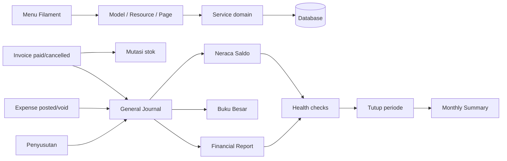
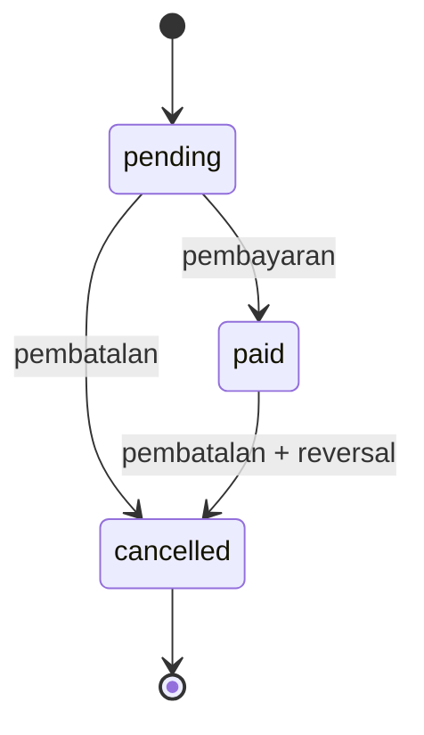
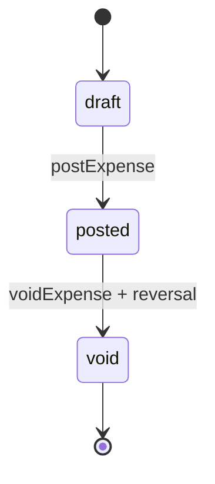

# System Mapping untuk White-Box Functional Testing

**Sistem:** Bloomorist  
**Framework:** Laravel + Filament  
**Tujuan:** peta implementasi untuk merancang, menjalankan, dan menelusuri *functional white-box testing*. Dokumen ini memetakan menu ke class, model/tabel, service, efek samping, aturan bisnis, dan skenario uji.

> **Batas dokumen:** peta ini berdasarkan kode aplikasi saat ini. Route pada panel Filament dihasilkan otomatis dari resource/page dan panel menggunakan `path('')`, sehingga URL relatif berada langsung di root aplikasi.

---

## 1. Arsitektur dan sumber kebenaran



| Lapisan | Sumber kebenaran | Prinsip yang harus diuji |
|---|---|---|
| Penjualan | `bl_invoices_t` dan `bl_invoice_items_t` | Invoice *paid* tidak boleh diposting dua kali. |
| Persediaan | `bl_products_t` dan `bl_stock_movements_t` | Stok berubah melalui transaksi terkontrol dan tidak boleh menjadi negatif saat invoice dibayar. |
| Akuntansi | `bl_general_journals_t` dan `bl_journal_items_t` | Jurnal harus seimbang dan hanya boleh berada pada periode akuntansi terbuka. |
| Laporan | Jurnal + periode + stock opname | Buku Besar, Neraca Saldo, Laba Rugi, Neraca, dan Arus Kas adalah hasil hitung, bukan input manual. |
| Ringkasan bulanan | `bl_monthly_summaries_t` | Dibuat/diubah saat periode berhasil ditutup; bukan pengganti jurnal. |
| Audit | `bl_accounting_audits_t` | Mutasi jurnal yang relevan meninggalkan jejak sebelum/sesudah. |

## 2. State machine dan kontrol lintas menu

### 2.1 Invoice



Implementasi: `App\Services\InvoiceStatusService::changeStatus()`.

| Transisi | Efek pada stok | Efek pada jurnal | Kontrol yang wajib diuji |
|---|---|---|---|
| `pending → paid` | Kurangi setiap produk; buat `sale` di `bl_stock_movements_t` | Buat jurnal pendapatan `INVOICE` | Cek stok cukup; `lockForUpdate()`; semua operasi atomik. |
| `pending → cancelled` | Tidak ada | Tidak ada | Tidak boleh ada stok/jurnal yang berubah. |
| `paid → cancelled` | Kembalikan setiap produk; buat `return` | Buat jurnal pembalik | Jurnal awal tidak dihapus. |
| selain transisi di atas | Tidak ada | Tidak ada | Service melempar exception; invoice `cancelled` bersifat final. |

Invoice selain `pending` tidak boleh diedit atau dihapus. Guard ada pada `App\Models\Invoice::booted()`.

### 2.2 Expense



Implementasi: `App\Services\ExpenseService`.

| Transisi | Efek jurnal | Kontrol yang wajib diuji |
|---|---|---|
| `draft → posted` | Debit akun beban, kredit akun Kas/Bank pilihan; `source_type=EXPENSE` | Hanya draft yang boleh diposting; transaksi dan lock baris. |
| `posted → void` | Jurnal pembalik; jurnal awal dipertahankan | Hanya posted yang boleh di-void. |
| edit/hapus selain draft | Tidak diizinkan | Guard pada `App\Models\Expense::booted()`. |

### 2.3 Jurnal dan periode akuntansi

| Aturan | Lokasi implementasi | Uji white-box minimum |
|---|---|---|
| Debit total = kredit total | `JournalEntryService::createManualEntry()` | Buat jurnal timpang; harus gagal dan tidak ada header/detail tersimpan. |
| Nilai total harus > 0 | `JournalEntryService::createManualEntry()` | Debit/kredit 0; harus gagal. |
| Tanggal wajib masuk periode | `GeneralJournal::booted()` event `saving` | Tanggal di luar semua periode; harus gagal. |
| Periode tertutup tidak dapat menerima, mengubah, atau menghapus jurnal | `GeneralJournal::booted()` | Uji create, update, dan delete jurnal dalam periode tertutup. |
| Audit jurnal | `AccountingAuditService` dan event model | Uji create/update/delete dan snapshot header + item. |

---

## 3. Peta menu aplikasi

### 3.1 Dashboard

| Item | Mapping |
|---|---|
| Menu / URL | Dashboard `/` |
| Kelas utama | `App\Filament\Pages\Dashboard` |
| Widget | `StatsOverview`, `SalesChart`, `SalesInsights`, `TopProducts`, `TopCustomers`, `LowStockProducts`, `CustomerType`, `MonthlyTrendChartWidget` |
| Data | Invoice, invoice item, produk, customer, dan ringkasan keuangan per widget |
| Input | Preset periode: hari ini, kemarin, bulan ini/sebelumnya, YTD, tahun lalu, semua, atau rentang kustom |
| Fokus pengujian | Pastikan semua widget menggunakan filter periode yang sama; rentang kustom kosong/tidak valid tidak menghasilkan query atau angka menyesatkan. |

### 3.2 Customer

| Item | Mapping |
|---|---|
| Menu / URL | Customers `/customers` |
| Resource / model | `CustomerResource` → `Customer` → `bl_customers_t` |
| Relasi | `Customer::invoices()` / `Invoice::customer()`; `membership_id` mengarah ke `bl_memberships_t` |
| Fungsi | CRUD pelanggan, data identitas/alamat/kontak, dan membership untuk diskon invoice |
| Fokus pengujian | Create/edit customer; pencarian nama/alias; customer member dipilih pada invoice lalu data terisi; perubahan customer tidak merusak snapshot invoice lama. |

### 3.3 Admin

| Item | Mapping |
|---|---|
| Menu / URL | Users `/users` |
| Resource / model | `UserResource` → `User` → `users` |
| Otorisasi | `UserPolicy`; kolom `is_super_admin` ada pada user |
| Fokus pengujian | User tanpa izin tidak dapat mengakses resource terproteksi; super admin dapat mengelola user; user audit pada transaksi dicatat bila tersedia. |

### 3.4 Generate Invoice

| Item | Mapping |
|---|---|
| Menu / URL | Generate Invoice `/generate-invoice` |
| Kelas utama | `App\Filament\Pages\GenerateInvoice` |
| Data tulis | `bl_invoices_t`, `bl_invoice_items_t`; PDF melalui `InvoiceController::download()` |
| Data baca | Produk aktif, customer, membership, tier harga (`harga_jual`, `harga_vendor`, `harga_dekor`) |
| Aturan utama | Harga dipilih dari tipe customer; diskon member default atau per-item; non-member mendukung diskon global/per item; total dipertahankan di invoice dan snapshot item. |
| Fokus pengujian | Uji semua tipe customer (`member`, `non_member`, `vendor`, `dekor`), Box/Wrapping, ongkir, diskon, edit pending, view paid/cancelled, dan hasil total/PDF. Jangan hanya menguji kalkulasi antarmuka—uji nilai yang tersimpan. |

### 3.5 Invoice History

| Item | Mapping |
|---|---|
| Menu / URL | Invoices `/invoices` |
| Resource / model | `InvoiceResource` → `Invoice` → `bl_invoices_t` + `bl_invoice_items_t` |
| Service | `InvoiceStatusService`, `AccountingService` |
| Efek samping | Status paid/cancelled mengubah stok, stock movement, dan jurnal sebagaimana bagian 2.1. |
| Fokus pengujian | Uji status change end-to-end, pembatalan, idempotensi, stok tidak cukup, larangan edit/hapus invoice non-pending, serta download PDF. |

### 3.6 Sales Report per Product

| Item | Mapping |
|---|---|
| Menu / URL | Product Sales Report `/product-sales-report` |
| Kelas utama | `App\Filament\Pages\ProductSalesReport` |
| Query sumber | `bl_products_t` dengan subquery `bl_invoice_items_t` + `bl_invoices_t` |
| Definisi hasil | Hanya invoice berstatus `paid`; `total_sold = SUM(quantity)`, `total_revenue = SUM(discount_price)` per produk. |
| Filter | Preset periode dan custom range. |
| Risiko / fokus uji | Filter menggunakan `invoices.created_at`, bukan `issued_date`. Uji invoice dengan tanggal terbit berbeda dari waktu pembuatan untuk mengonfirmasi apakah perilaku ini memang keputusan bisnis yang diinginkan. Uji produk tanpa penjualan, retur/cancelled, batas awal/akhir rentang, dan pengurutan. |

### 3.7 Products

| Item | Mapping |
|---|---|
| Menu / URL | Products `/products` |
| Resource / model | `ProductResource` → `Product` → `bl_products_t` |
| Data | SKU, nama, kategori, harga beli/jual/vendor/dekor, stok, `is_active` |
| Relasi | `Product::stockMovements()` dan `Product::invoiceItems()` |
| Fokus pengujian | Unik/generasi SKU (`SkuGeneratorService`), produk inactive tidak dapat dipilih dalam invoice baru, perubahan tier harga memengaruhi invoice baru saja, dan stok tidak dimutasi oleh edit master produk biasa. |

### 3.8 Stock Movement

| Item | Mapping |
|---|---|
| Menu / URL | Stock Movements `/stock-movements` |
| Resource / model | `StockMovementResource` → `StockMovement` → `bl_stock_movements_t` |
| Asal mutasi | Invoice paid (`sale`), invoice cancelled (`return`), serta aksi stok/penyesuaian yang sesuai resource/observer. |
| Akuntansi | `AccountingService::createStockAdjustmentJournal()` membuat jurnal untuk koreksi/loss bila akun tersedia. |
| Fokus pengujian | Mutasi harus memiliki produk, tipe, qty, referensi, dan user bila proses otomatis; paid membuat satu mutasi per item; cancelled mengembalikan qty tepat sekali; loss/out menghasilkan pasangan jurnal debit 6106 dan kredit 1104. |

### 3.9 Expenses

| Item | Mapping |
|---|---|
| Menu / URL | Expenses `/expenses` |
| Resource / model | `ExpenseResource` → `Expense` → `bl_expenses_t` |
| Service | `ExpenseService`, `AccountingService::createExpenseJournal()` / `createExpenseReversalJournal()` |
| Input akuntansi | `coa_id` adalah akun beban (debit); `coa_kredit_id` adalah Kas/Bank (kredit). |
| Fokus pengujian | Draft dapat diubah/hapus; post menghasilkan tepat dua item jurnal seimbang; void membalik kedua sisi tanpa menghapus jurnal awal; post/void berulang dan race-condition harus gagal aman. |

---

## 4. Accounting & Finances

### 4.1 Accounting Periods

| Item | Mapping |
|---|---|
| URL | `/accounting-periods` |
| Resource / model | `AccountingPeriodResource` → `AccountingPeriod` → `bl_accounting_periods_t` |
| Service | `PeriodClosingService`, `FinancialHealthCheckService`, `CashFlowService`, `AccountingService` |
| Field kritis | `start_date`, `end_date`, `opening_cash_balance`, `closing_inventory_value`, `status`, `closed_at` |
| Aksi kritis | Tutup periode: stock opname wajib diisi; health check Neraca Saldo, Neraca, Arus Kas harus sehat; period menjadi `closed`; `MonthlySummary` dibuat/diperbarui atomik. |
| Uji wajib | Tutup tanpa stock opname; setiap health check gagal; close sukses; close dua kali; jurnal sesudah close; monthly summary harus sesuai Laba Rugi dan Arus Kas. |

### 4.2 Daftar Akun

| Item | Mapping |
|---|---|
| URL | `/chart-of-accounts` |
| Resource / model | `ChartOfAccountResource` → `ChartOfAccount` → `bl_coa_t` |
| Field kritis | `kode_akun`, `nama_akun`, `kategori`, `saldo_normal` |
| Dipakai oleh | Jurnal, expense, penyusutan, Neraca Saldo, Buku Besar, Laba Rugi, Neraca, Arus Kas |
| Uji wajib | Kode unik; kategori dan saldo normal valid; akun baru muncul pada Neraca Saldo; saldo normal debit/kredit membalik arah saldo dengan benar. |

### 4.3 Jurnal Umum

| Item | Mapping |
|---|---|
| URL | `/general-journals` |
| Resource / model | `GeneralJournalResource` → `GeneralJournal` + `JournalItem` → `bl_general_journals_t` + `bl_journal_items_t` |
| Service | `JournalEntryService`, `AccountingAuditService` |
| Jenis sumber | `MANUAL`, `INVOICE`, `EXPENSE`, `DEPRECIATION`, `CLOSING`, `STOCK_ADJUSTMENT` |
| Uji wajib | Aturan di bagian 2.3, minimal dua baris UI, audit log, edit/hapus periode open, dan larangan perubahan periode closed. |

### 4.4 Buku Besar

| Item | Mapping |
|---|---|
| URL | `/buku-besar` |
| Kelas / service | `BukuBesar` → `AccountingService::getLedgerEntries()` |
| Sumber | Journal item menurut akun dan rentang/periode |
| Hasil | Baris jurnal terurut dan saldo berjalan sesuai `saldo_normal` akun. |
| Uji wajib | Akun debit dan kredit, urutan tanggal/nomor, saldo berjalan, akun tanpa transaksi, dan batas tanggal/periode. |

### 4.5 Neraca Saldo

| Item | Mapping |
|---|---|
| URL | `/neraca-saldo` |
| Kelas / service | `NeracaSaldo` → `TrialBalanceService::getForPeriod()` |
| Sumber | Agregasi journal item yang tanggalnya berada di rentang `AccountingPeriod`. |
| Hasil | Net debit/kredit untuk setiap akun dan total balance. |
| Uji wajib | Jurnal seimbang, akun debit/kredit, akun tanpa transaksi, filter hanya dalam periode, dan status `is_balanced`. |

### 4.6 Financial Report

| Item | Mapping |
|---|---|
| URL | `/financial-reports` |
| Kelas / service | `FinancialReports`, `AccountingService`, `CashFlowService`, `FinancialHealthCheckService` |
| Tab | Laba Rugi, Neraca, Arus Kas |
| Laba Rugi | Persediaan periodik: persediaan awal + pembelian bersih + angkut pembelian − stock opname akhir = HPP. |
| Neraca | Saldo aset/kewajiban/modal sampai tanggal laporan; persediaan akhir menggantikan saldo jurnal 1104 untuk penyajian; laba ditahan dihitung kumulatif. |
| Arus Kas | Metode langsung: efek Kas/Bank (`1101`, `1102`, kompatibilitas `1010`) dikelompokkan melalui akun lawan dalam jurnal yang sama. |
| Uji wajib | Rumus HPP dan stock opname, akun kontra, Neraca seimbang, semua kelompok Arus Kas, wildcard `51*`/`6*`, serta rekonsiliasi kas akhir dengan saldo Kas/Bank. |

### 4.7 Penyusutan Peralatan

| Item | Mapping |
|---|---|
| URL | `/fixed-assets` |
| Resource / model | `FixedAssetResource` → `FixedAsset` / `FixedAssetDepreciation` → `bl_fixed_assets_t` / `bl_fixed_asset_depreciations_t` |
| Service | `DepreciationService` |
| Rumus | Garis lurus: harga perolehan ÷ umur manfaat; posting = akumulasi periode ini − akumulasi periode sebelumnya. |
| Efek jurnal | Debit akun beban penyusutan; kredit akun akumulasi penyusutan; `source_type=DEPRECIATION`. |
| Uji wajib | Catch-up pertama, periode berikutnya hanya selisih bulanan, aset setelah periode, umur manfaat maksimum, tidak ada aset aktif, akun penyusutan aset tidak konsisten, periode closed, dan penolakan posting ganda. |

### 4.8 Accounting Audit Trail

| Item | Mapping |
|---|---|
| URL | `/accounting-audits` |
| Resource / model | `AccountingAuditResource` → `AccountingAudit` → `bl_accounting_audits_t` |
| Service | `AccountingAuditService` |
| Isi | `user_id`, `journal_id`, aksi, nilai lama, nilai baru |
| Uji wajib | Create jurnal menghasilkan snapshot lengkap; update/delete mencatat event; audit terhubung ke user dan jurnal yang benar; audit trail bersifat baca-saja bagi peran operasional. |

---

## 5. Matriks dependency data

| Menu pemicu | Menulis | Membaca / memengaruhi berikutnya |
|---|---|---|
| Generate Invoice | Invoice dan item | Invoice History, PDF, Sales Report per Product |
| Invoice History: paid/cancelled | Invoice status, produk.stok, stock movement, jurnal, journal item | Stock Movement, Jurnal Umum, semua laporan keuangan |
| Expenses: post/void | Expense status, jurnal, journal item | Jurnal Umum, laporan keuangan |
| Stock adjustment | Stok/mutasi dan, bila berlaku, jurnal | Produk, Stock Movement, laporan keuangan |
| Jurnal Umum | Jurnal, item, audit | Buku Besar, Neraca Saldo, Financial Report, Audit Trail |
| Penyusutan | Fixed asset depreciation, jurnal, item | Jurnal Umum, Neraca, Laba Rugi |
| Tutup Periode | Status periode, monthly summary | Dashboard/tren; mencegah mutasi jurnal pada periode tersebut |

## 6. Cakupan test otomatis yang sudah ada

Test feature yang teridentifikasi:

| File | Fokus |
|---|---|
| `tests/Feature/GeneralJournalTest.php` | Jurnal manual dan audit. |
| `tests/Feature/TrialBalanceTest.php` | Agregasi Neraca Saldo dan health check. |
| `tests/Feature/PeriodicFinancialReportTest.php` | HPP periodik, Neraca, dan balance check. |
| `tests/Feature/CashFlowTest.php` | Klasifikasi serta rekonsiliasi Arus Kas. |
| `tests/Feature/DepreciationTest.php` | Posting penyusutan. |
| `tests/Feature/PeriodClosingTest.php` | Tutup periode dan Monthly Summary. |
| `tests/Feature/ClosingEntryTest.php` | Jurnal penutup formal dan audit. |
| `tests/Feature/ReportLineTemplateTest.php` | Engine template laporan. |

### Gap prioritas untuk dibuat/diperkuat

1. `InvoiceStatusService`: semua transisi status, stok kurang, idempotensi, dan rollback atomik.
2. `ExpenseService`: post/void, penguncian status, idempotensi jurnal, dan larangan edit/hapus.
3. Halaman/Resource Filament: akses policy, validasi form, filter tanggal, tindakan UI, dan redirect/notification.
4. Dashboard dan Product Sales Report: konsistensi filter serta definisi tanggal (`created_at` versus `issued_date`).
5. Proteksi periode closed pada seluruh jalur tulis otomatis: invoice, expense, stock adjustment, dan penyusutan.
6. Audit trail update/delete, bukan hanya create.

## 7. Urutan eksekusi white-box yang direkomendasikan

1. Seed COA, user, produk, customer, dan satu periode `open` yang eksplisit.
2. Uji unit/service untuk validasi dan state machine, termasuk semua jalur gagal.
3. Uji feature/database untuk setiap efek samping atomik: status, stok, mutasi, header jurnal, detail jurnal, audit.
4. Uji laporan memakai jurnal yang sama, lalu rekonsiliasi Neraca Saldo → Neraca → Arus Kas.
5. Uji tutup periode; sesudah close, ulangi setiap operasi tulis dan pastikan semuanya ditolak.
6. Uji UI Filament/policy untuk menu sesuai peran pengguna dan filter laporan.

## 8. Perintah verifikasi awal

```powershell
php artisan test
```

Gunakan transaksi database atau `RefreshDatabase` pada test agar setiap kasus independen. Untuk setiap operasi yang seharusnya atomik, assert **seluruh** tabel terdampak, bukan hanya status akhir entitas utama.
